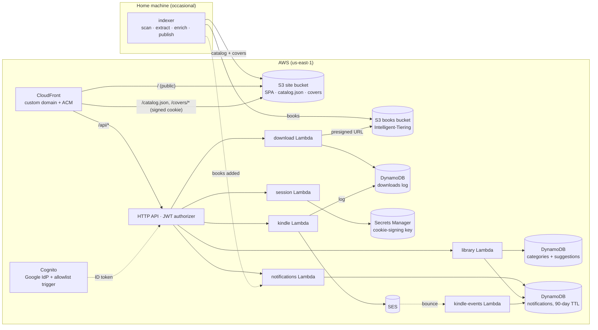

# Lit Library

[](https://github.com/DavidJDrake/lit-library/actions/workflows/ci.yml)

A private, personal ebook library on AWS: sign in with Google, browse ~1,300 books
with covers, search and filter them in the browser, and download any title
through a short-lived link. The whole thing runs for well under **$1/month** —
no servers, no database to babysit, and nothing on the home machine needs to
be online for the site to work.

> **Built with Claude Code.** This project was developed end-to-end with
> [Claude Code](https://claude.com/claude-code) — see [How it was built](#how-it-was-built).

## What it does

- **Google sign-in, allowlist-gated.** Amazon Cognito federates to Google; a
  pre-signup Lambda rejects any account not on an allowlist kept in SSM
  Parameter Store (editable without a redeploy). Native Cognito sign-up is
  disabled at both the client and the trigger, so the only door is Google.
- **Everything is gated, not just the files.** The catalog and cover images
  are served by CloudFront only with a signed cookie that the site issues
  after sign-in (2 h, renewed silently while you're signed in, `HttpOnly`);
  a CloudFront Function blocks
  percent-encoded and dotted-path attempts to route around the gate.
  Book downloads are 15-minute presigned S3 URLs minted by a JWT-protected
  API and logged to DynamoDB.
- **Instant search.** The catalog (`catalog.json`, ~1 MB) loads once; fuzzy,
  word-order-independent search and faceted filters (category, format,
  publisher, bundle, author, year) run entirely client-side.
- **Shared, editable categories.** Anyone signed in can move a book to another
  category or suggest a new one; members of a Cognito `admins` group accept
  suggestions or add categories directly. Edits live in a small DynamoDB
  table that the site merges over the static catalog, and
  `scripts/pull-edits.py` folds them back into `metadata/overrides.yaml`.
- **Notifications.** A bell in the header shows new suggestions (admins), the
  outcome of your own suggestions, new categories, and "N new books added"
  after each publish. Per-recipient rows in a small DynamoDB table with a
  90-day TTL; the site polls every five minutes.
- **Send to Kindle.** One click emails the EPUB (or PDF) to a saved `@kindle.com`
  address through Amazon SES, up to 28 MB. Save several devices, pick one per send,
  and a bounce turns into a notification naming the device that rejected it. Sends
  happen synchronously in one Lambda, which is right for a handful of readers — if
  volume ever grows, the upgrade path is an SQS queue and a worker Lambda.
- **Cheap storage.** ~73 GB of books sit in S3 Intelligent-Tiering, which
  drifts untouched titles down to ~$0.004/GB-month with no retrieval fees.
- **Metadata from the files themselves.** A Python indexer reads embedded
  EPUB/PDF metadata, groups EPUB+PDF pairs into one book, enriches titles
  via Open Library / Google Books (cached on disk), derives categories, and
  renders WebP cover thumbnails. Manual corrections go in an `overrides.yaml`.

## Architecture



**Request flow:** visit the site → Google sign-in via the Cognito hosted UI
(PKCE code flow, hand-rolled, tokens in `sessionStorage`) → the SPA calls
`GET /api/session` to obtain CloudFront signed cookies → loads `catalog.json`
and covers → a download click calls `POST /api/download` with the ID token
and navigates a hidden iframe to the returned presigned URL.

## Repository layout

| Path | What |
|---|---|
| `indexer/` | Python CLI (`ebook_indexer`): scan → extract → group → enrich → categorize → catalog → publish. 81 tests, all offline. |
| `infra/` | AWS CDK (TypeScript): storage, CloudFront + signing key group, Cognito, HTTP API, six Lambdas. 227 tests (CDK assertions + Lambda units), all offline. |
| `web/` | React + Vite + TypeScript SPA. 211 tests (vitest + Testing Library), all offline. |
| `scripts/` | Glue: copy CDK outputs into config, write web env files, generate the signing key, deploy the web app, refresh the catalog (`publish-new.sh`), back up state (`backup.sh`), make an admin (`make-admin.sh`), pull category edits (`pull-edits.py`), notify readers of new books (`notify-books-added.py`, run by `publish-new.sh`). |
| `docs/superpowers/` | The design specs and the implementation plans that were actually executed (see below). |

## How it was built

This repository was produced with **Claude Code** (Claude Fable 5) and is
kept as an honest record of that process rather than a cleaned-up
afterthought:

- `docs/superpowers/specs/` holds the design specs that came out of
  brainstorming sessions — including the decisions that changed direction
  (the original "upload on request" design was dropped once the storage
  math showed the whole library costs ~$0.40/month to keep in S3).
- `docs/superpowers/plans/` holds the implementation plans that were actually
  executed, each broken into TDD tasks, by dispatching a fresh sub-agent per
  task, reviewing every task's diff for spec compliance and quality, running
  fix rounds where reviews found problems, and finishing each plan with a
  whole-branch review before merge. Several real bugs were caught that way
  (a React StrictMode double-run that broke sign-in, word-order-sensitive
  search, an over-broad IAM grant, a cache-policy rule CloudFront rejects).
- Commits carry `Co-Authored-By: Claude` trailers. The human role was product
  decisions, design approval, the reviews' final say, the manual console
  steps (Google OAuth client, DNS), and live smoke testing.

If you're evaluating AI-assisted development, the plans and the commit
history are the interesting part.

## Deploy your own

Prerequisites: an AWS account with CLI credentials, a Route 53 hosted zone
for your domain, Node 22, Python 3.11+ with [`uv`](https://docs.astral.sh/uv/),
and a Google Cloud project.

1. **Configure.** Copy `infra/config.example.json` → `infra/config.local.json`
   and `config.example.yaml` → `config.yaml`; fill in your account, domain,
   hosted zone, Cognito domain prefix, and the first allowed email. Both files
   are gitignored.
2. **Google OAuth client.** In Google Cloud Console create an OAuth consent
   screen (External, published) and a *Web application* client whose redirect
   URI is `https://<cognito-prefix>.auth.<region>.amazoncognito.com/oauth2/idpresponse`.
   Store it: `aws secretsmanager create-secret --name ebook-share/google-oauth --secret-string '{"client_id":"…","client_secret":"…"}'`.
3. **Signing key.** `scripts/make-signing-key.sh` (private key → Secrets
   Manager, public key → `config.local.json`).
4. **Deploy infra.** `cd infra && npm ci && npx cdk bootstrap && npm run deploy`,
   then `python3 scripts/apply-outputs.py` to point the indexer at the new buckets.
5. **Index and publish the library.** `cd indexer && uv venv .venv && uv pip install --python .venv/bin/python -e '.[dev]'`,
   then `.venv/bin/python -m ebook_indexer index --config ../config.yaml` and
   `… publish --config ../config.yaml` (resumable; the first run enriches every title).
6. **Deploy the web app.** `cd web && npm ci`, then `scripts/deploy-web.sh`.
7. **Invite people.** `aws ssm put-parameter --name /ebook-share/allowed-emails --type String --overwrite --value "you@example.com,friend@example.com"`.
8. **Make yourself an admin** (after signing in once): `scripts/make-admin.sh you@example.com`, then sign out and back in.

`infra/README.md` has the operational details (rotating the signing key,
removing an account, what must never be renamed after the first deploy).

## Development

```bash
cd indexer && .venv/bin/pytest -q          # Python indexer
cd infra   && npm test && npm run typecheck && npx cdk synth   # CDK + Lambdas
cd web     && npm test && npm run typecheck && npm run build   # SPA
cd web     && npm run dev                   # local SPA against the live catalog/API (needs config)
```

Every suite runs offline — no AWS credentials, no network.

GitHub Actions runs the same three suites, both typechecks, `cdk synth` (against the
example config), and the web build on every push and pull request; Dependabot opens
weekly grouped update PRs for the three package manifests and the workflow actions.

## Security notes and known trade-offs

- Only `index.html`, the hashed JS/CSS bundle, `robots.txt` (`Disallow: /`),
  and the privacy/terms pages are public. Catalog, covers, and books require
  sign-in.
- Session cookies live 2 hours and are renewed every 90 minutes while the app
  is open. Sign-out clears them via an unauthenticated `DELETE /api/session`
  (it only clears cookies, so it works even without a valid Google session).
  Removing someone from the allowlist only stops *new* accounts from being
  created; to revoke someone who has already signed in, delete their Cognito
  user (`admin-delete-user`) — their session cookie then expires within at
  most 2 hours and their tokens stop refreshing.
- The books bucket is private; the only way to a file is a presigned URL
  minted for a signed-in user, and every download is logged.
- CloudWatch alarms email the owner on any Lambda error, any API 5xx, and when
  month-to-date charges pass $5 (`infra/README.md` has the two one-time setup steps).
- Category edits are attributed (who/when) and admin actions require the
  `admins` group claim on the ID token; the API checks it, the UI only hides
  buttons.
- The notifications Lambda may list Cognito users (to fan out) and read the
  library table; the indexer reaches it only through `lambda:InvokeFunction`
  with your own AWS credentials.
- Every Lambda writes structured JSON events (`event` field) to CloudWatch
  Logs; the two Kindle Lambdas keep them 3 months.

## License

[MIT](LICENSE) — free to use, modify, and share. Please don't use it to share
content you don't have the right to share.
